# Jarkom-Modul-1-T09-2021

Nama Anggota | NRP
------------------- | --------------		
Natasya Abygail N | 05111940000020
Muhammad Hilmi Ramadhan | 05311940000044
Sri Puspita Dewi | 05111940000045

## List of Contents :
- [Soal 1](#soal-1)
	- [Jawaban](#jawaban-soal-1)
- [Soal 2](#soal-2)
	- [Jawaban](#jawaban-soal-2)
- [Soal 3](#soal-3)
	- [Jawaban](#jawaban-soal-3)
- [Soal 4](#soal-4)
	- [Jawaban](#jawaban-soal-4)
- [Soal 5](#soal-5)
	- [Jawaban](#jawaban-soal-5)
- [Soal 6](#soal-6)
	- [Jawaban](#jawaban-soal-6)
- [Soal 7](#soal-7)
	- [Jawaban](#jawaban-soal-7)
- [Soal 8](#soal-8)
	- [Jawaban](#jawaban-soal-8)
- [Soal 9](#soal-9)
	- [Jawaban](#jawaban-soal-9)
- [Soal 10](#soal-10)
	- [Jawaban](#jawaban-soal-10)
- [Soal 11](#soal-11)
	- [Jawaban](#jawaban-soal-11)
- [Soal 12](#soal-12)
	- [Jawaban](#jawaban-soal-12)
- [Soal 13](#soal-13)
	- [Jawaban](#jawaban-soal-13)
- [Soal 14](#soal-14)
	- [Jawaban](#jawaban-soal-14)
- [Soal 15](#soal-15)
	- [Jawaban](#jawaban-soal-15)

## Soal 1 :

Sebutkan webserver yang digunakan pada `"ichimarumaru.tech"`!
## Jawaban Soal 1 : 

Webserver yang digunakan adalah **nginx/1.18.0 (Ubuntu)**. Kami menggunakan display filter **http** saat mengakses `"ichimarumaru.tech"` untuk mendapatkan webserver yang digunakan.

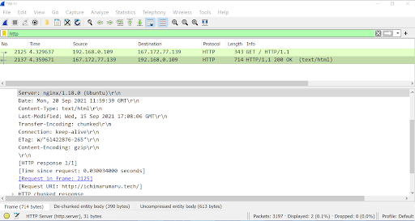

---

## Soal 2 :
---
Temukan paket dari web-web yang menggunakan `basic authentication method`!
## Jawaban Soal 2 : 
---
Ketik **http.authbasic** di `display filter` wireshark

---

## Soal 3 :
---
Ikuti `perintah di basic.ichimarumaru.tech`! **Username dan password** bisa didapatkan dari `file .pcapng`!
## Jawaban Soal 3 :
--- 
Ketik **http.host contains "basic.ichimarumaru.tech"** di `display filter` wireshark

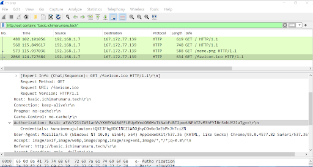

Lalu kita mengisi pertanyaan di web `basic.ichimarumaru.tech` sebagaimana jawaban juga terlampir

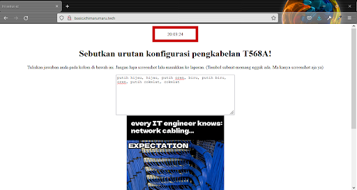

---

## Soal 4 :
---
Temukan `paket mysql` yang mengandung `perintah query select`!
## Jawaban Soal 4 :
--- 
Pertama ketik **`frame contain “select”`** pada display filter di wireshark
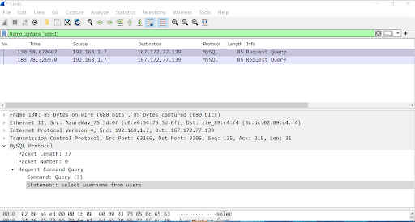
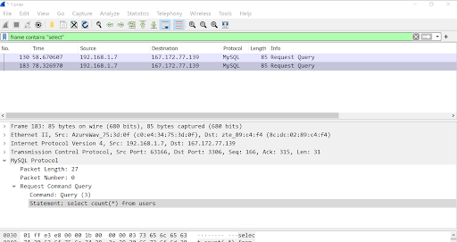

---

## Soal 5 :
---
`Login ke portal.ichimarumaru.tech` kemudian ikuti perintahnya! `Username dan password` bisa didapat dari `query insert pada table users dari file .pcap`!
## Jawaban Soal 5 : 
---
Ketik **mysql** di display filter pada wireshark

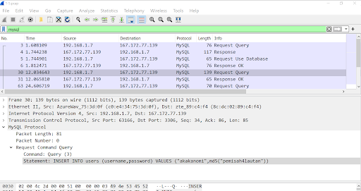

Setelah sudah mendapatkan `username dan password` maka ikuti pertanyaan dan jawab pertanyaan pada web

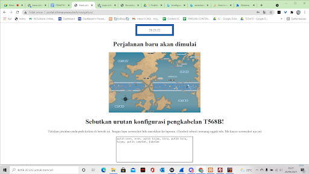

---

## Soal 6 :
---
Cari `username dan password` ketika melakukan` login ke FTP Server`!
## Jawaban Soal 6 : 
---
Ketik **http.authbasic** pada `display filter` di wireshark

---

## Soal 7 :
---
Ada `500 file zip` yang disimpan ke `FTP Server` dengan nama 0.zip, 1.zip, 2.zip, ..., 499.zip. Simpan dan Buka file pdf tersebut. (Hint = nama pdf-nya `"Real.pdf"`)
## Jawaban Soal 7 : 
---
Memfilter dengan display filter berupa **frame contains “Real.pdf”**

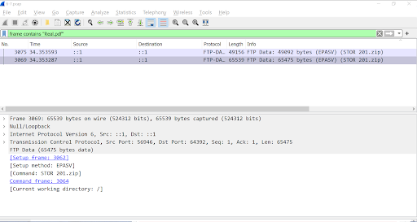

Ketika berhasil mendownload hasil file real.pdf.

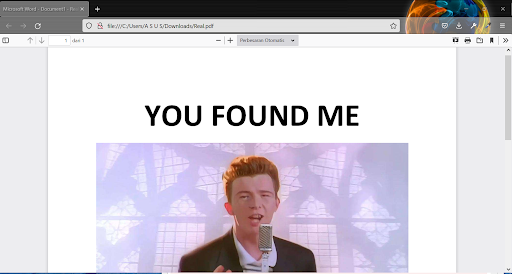

---

## Soal 8 :
---
Cari paket yang menunjukan `pengambilan file dari FTP` tersebut!
## Jawaban Soal 8 : 
---
**ftp-data.command contains “RETR”**, kelompok kami tidak menemukan adanya paket yang menunjukkan pengambilan file dari FTP. Command `display filter` tersebut bertujuan untk menemukan riwayat ketika adanya pengunduhan (pengambilan file).

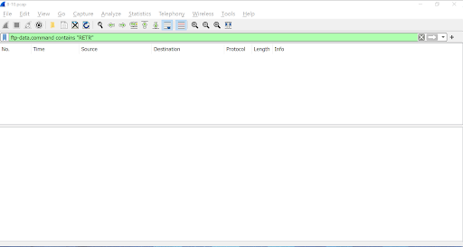

---

## Soal 9 :
---
Dari `paket-paket yang menuju FTP` terdapat indikasi penyimpanan` beberapa file`. Salah satunya adalah sebuah file berisi data rahasia dengan nama `"secret.zip"`. Simpan dan buka file tersebut!
## Jawaban Soal 9 : 
---
Pertama lakukan `display filter`dengan perintah **Ftp-data.command contains “STOR”** pada di wireshark

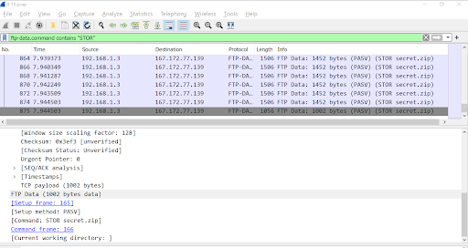

Hasil isi dari paket  dapat ditelusuri lebih dalam dengan **klik kanan -> Follow -> TCP Stream dan simpan sebagai datanya dari ASCII ke RAW** kemudian di save as filenya.

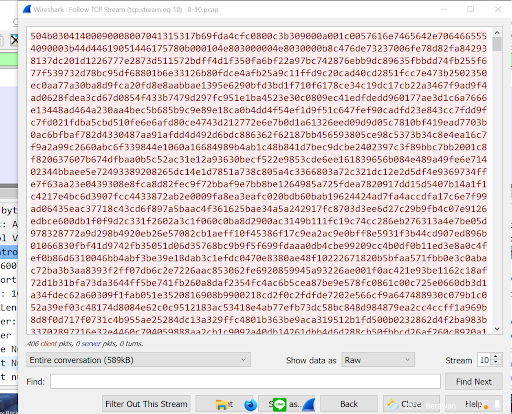

Selanjutnya lakukan` display filtering` dengan command **ftp.request.command == STOR** yang `file.txt` kemungkinan mengandung sebuah password dan di dapat kan beberapa. Detail mendapatkan password dijelaskan pada nomor selanjutnya.
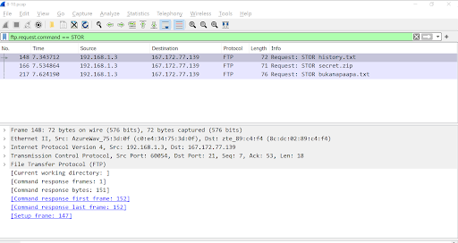
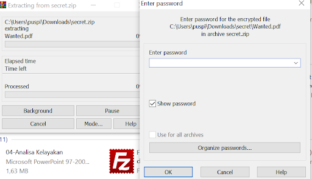

---

## Soal 10 :
---
Selain itu terdapat `"history.txt"` yang kemungkinan berisi history bash server tersebut! Gunakan isi dari "history.txt" untuk menemukan `password` untuk membuka file rahasia yang ada di `"secret.zip"`!
## Jawaban Soal 10 : 
---
Kami menggunakan `capture filter` dengan command **ftp-data contains “.txt”**

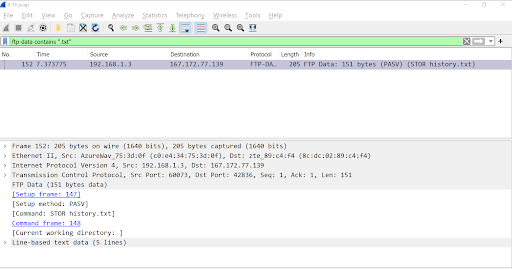

Hasil paket data menunjukan `password` berada di file **“bukanapaapa.txt”**

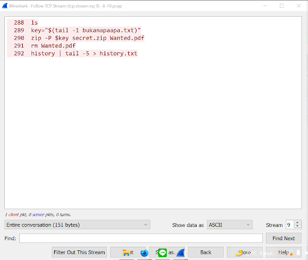

Mencari file diatas dengan mengetik** ftp-data**. Kemudian `mengambil password` pada file **“bukanapaapa.txt”** dengan mengklik kanan pada **info → klik Follow → TCP Stream**. Maka password akan muncul seperti gambar dibawah

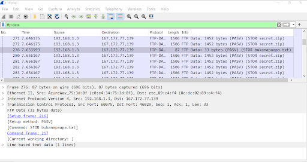
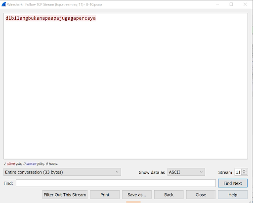

`Memasukan pw `yang sudah di dapat dan dimasukkan `kedalam secret.zip`

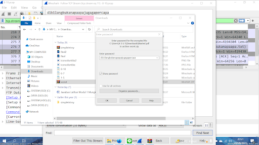

Hasil gambar yang didwonload di `wanted.pdf`

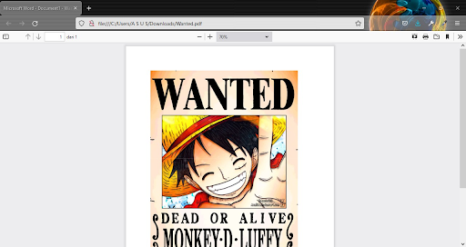

---

## Soal 11 :
---
Filter sehingga `wireshark hanya mengambil` paket yang berasal dari `port 80`!
## Jawaban Soal 11 : 
---
Kami menggunakan `capture filter` dengan sintaks **src port 80**
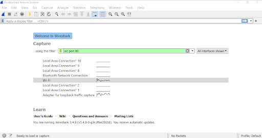
Selanjutnya akan menampilkan paket-paket yang berasal dari `port 80`
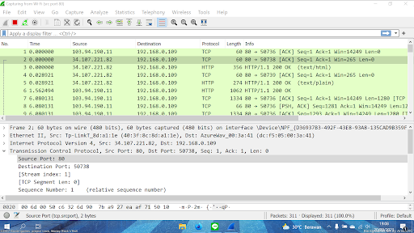

---

## Soal 12 :
---
Filter sehingga `wireshark hanya mengambil` paket yang mengandung `port 21`!
## Jawaban Soal 12 : 
---
Kami memulai dengan **mengakses filezilla client dan server (melalui XAMPP)** , kemudian pada wireshark kami mengetik `port [dituju], port 21`, di wireshark 
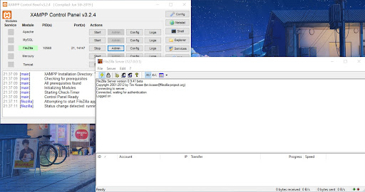
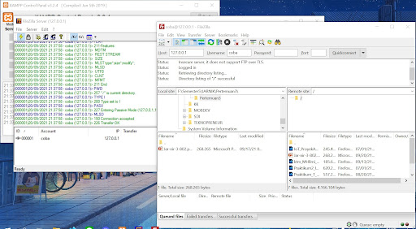
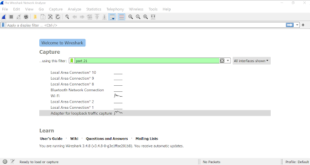

Sehingga akan muncul hasil dari capture filter tersebut

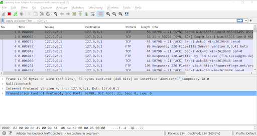

---

## Soal 13 :
---
Filter sehingga `wireshark hanya menampilkan` paket yang `menuju port 443`!
## Jawaban Soal 13 : 
---
Pertama kami  mengetik **dst port [dituju], dst port 443**, di wireshark tepatnya pada `capture filter`
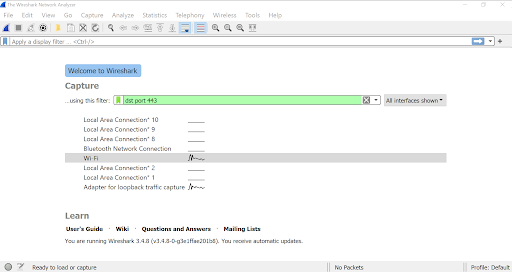

Selanjutnya maka akan **muncul paket yang menuju port 443**
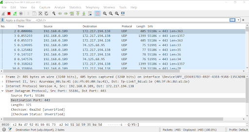

---

## Soal 14 :
---
Filter sehingga wireshark hanya mengambil paket yang tujuannya ke kemenag.go.id!

## Jawaban Soal 14 : 
---
Melakukan `ping ke kemenag.go.id` untuk mencari ipnya 
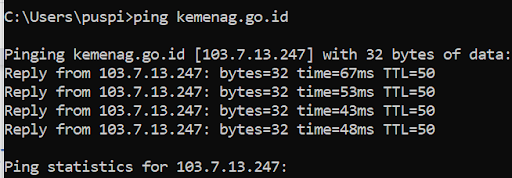

Atau buka wireshark langsun lalu  mengetik `dst host [Nama web]`, Disini kami mengetik `dst host kemenag.go.id`
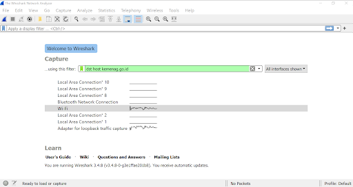

Lalu akan muncul paket yang tujuannya ke kemenang.go.id
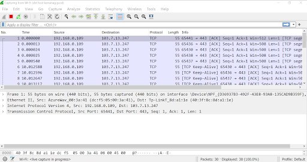

---

## Soal 15 :
---
Filter sehingga wireshark hanya mengambil paket yang berasal dari ip kalian!

## Jawaban Soal 15 : 
---
Pertama kami melakukan `ipconfig` untuk mencari ip sendiri `(192.168.246.87)`
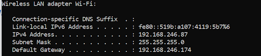

Lalu mengetik `src host [ip sendiri]`, kami menggunakan `ip 192.168.246.87`
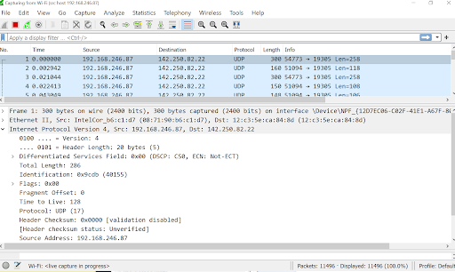

---
