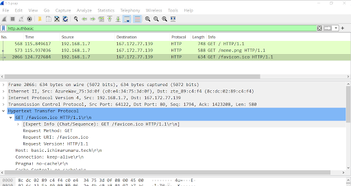

# Jarkom-Modul-1-T09-2021

Nama Anggota | NRP
------------------- | --------------		
Natasya Abygail N | 05111940000020
Muhammad Hilmi Ramadhan | 05311940000044
Sri Puspita Dewi | 05111940000045

## List of Contents :
- [Soal 1](#Cara-Pengerjaan)
	- [Jawaban](#Jawaban)
- [Soal 2](#Cara-Pengerjaan)
	- [Jawaban](#Jawaban)
- [Soal 3](#Cara-Pengerjaan)
	- [Jawaban](#Jawaban)
- [Soal 4](#Cara-Pengerjaan)
	- [Jawaban](#Jawaban)
- [Soal 5](#Cara-Pengerjaan)
	- [Jawaban](#Jawaban)
- [Soal 6](#Cara-Pengerjaan)
	- [Jawaban](#Jawaban)
- [Soal 7](#Cara-Pengerjaan)
	- [Jawaban](#Jawaban)
- [Soal 8](#Cara-Pengerjaan)
	- [Jawaban](#Jawaban)
- [Soal 9](#Cara-Pengerjaan)
	- [Jawaban](#Jawaban)
- [Soal 10](#Cara-Pengerjaan)
	- [Jawaban](#Jawaban)
- [Soal 11](#Cara-Pengerjaan)
	- [Jawaban](#Jawaban)
- [Soal 12](#Cara-Pengerjaan)
	- [Jawaban](#Jawaban)
- [Soal 13](#Cara-Pengerjaan)
	- [Jawaban](#Jawaban)
- [Soal 14](#Cara-Pengerjaan)
	- [Jawaban](#Jawaban)
- [Soal 15](#Cara-Pengerjaan)
	- [Jawaban](#Jawaban)

## Nomor 1 :
### Soal :
Sebutkan webserver yang digunakan pada "ichimarumaru.tech"!
#### Jawaban : 
Webserver yang digunakan adalah nginx/1.18.0 (Ubuntu)\r\n. Kami menggunakan filter http saat mengakses "ichimarumaru.tech" untuk mendapatkan webserver yang digunakan.

## Nomor 2 :
### Soal :
Temukan paket dari web-web yang menggunakan basic authentication method!
#### Jawaban : 
Ketik http.authbasic di wireshark

## Nomor 3 :
### Soal :
Ikuti perintah di basic.ichimarumaru.tech! Username dan password bisa didapatkan dari file .pcapng!
#### Jawaban : 
Ketik http.host contains "basic.ichimarumaru.tech" di wireshark

Lalu kita mengisi pertanyaan di web basic.ichimarumaru.tech

## Nomor 4 :
### Soal :
Temukan paket mysql yang mengandung perintah query select!
#### Jawaban : 
Pertama ketik frame contain “select”

## Nomor 5 :
### Soal :
Login ke portal.ichimarumaru.tech kemudian ikuti perintahnya! Username dan password bisa didapat dari query insert pada table users dari file .pcap!
#### Jawaban : 
Ketik mysql di wireshark

Mengetik jawaban dari pertanyaan web

## Nomor 6 :
### Soal :
Cari username dan password ketika melakukan login ke FTP Server!
#### Jawaban : 
Ketik http.authbasic di wireshark

## Nomor 7 :
### Soal :
Ada 500 file zip yang disimpan ke FTP Server dengan nama 0.zip, 1.zip, 2.zip, ..., 499.zip. Simpan dan Buka file pdf tersebut. (Hint = nama pdf-nya "Real.pdf")
#### Jawaban : 
Memfilter dengan display filter berupa frame contains “Real.pdf”

Ketika berhasil mendownload hasil file real.pdf.

## Nomor 8 :
### Soal :
Cari paket yang menunjukan pengambilan file dari FTP tersebut!
#### Jawaban : 
ftp-data.command contains “RETR”, kelompok kami tidak menemukan adanya paket yang mennunjukkan pengambilan file dari FTP.

## Nomor 9 :
### Soal :
Dari paket-paket yang menuju FTP terdapat inidkasi penyimpanan beberapa file. Salah satunya adalah sebuah file berisi data rahasia dengan nama "secret.zip". Simpan dan buka file tersebut!
#### Jawaban : 
Pertama lakukan display filter dengan perintah Ftp-data.command contains “STOR”, di wire shark

Hasil isi dari paket , yang dapat ditelusuri lebih dalam dengan klik kanan -> Follow -> TCP Stream dan simpan sebagai datanya dari ASCII ke RAW kemudian di save as filenya.

Selanjutnya lakukan display filtering dengan yang file.txt kemungkinan mengandung sebuah password dan di dapat kan beberapa. Detail mendapatkan password dijelaskan pada nomor selanjutnya.

## Nomor 10 :
### Soal :
Selain itu terdapat "history.txt" yang kemungkinan berisi history bash server tersebut! Gunakan isi dari "history.txt" untuk menemukan password untuk membuka file rahasia yang ada di "secret.zip"!
#### Jawaban : 
Kami menggunakan capture filter dengan sintaks ftp-data contains “.txt”

Hasil paket data menunjukan password berada di file “bukanapaapa.txt”

Mencari file diatas dengan mengetik ftp-data. Kemudian mengambil password pada file “bukanapaapa.txt” dengan mengklik kanan pada info → klik Follow → TCP Stream. Maka password akan muncul seperti gambar dibawah

Memasukan pw yang sudah di dapat dan dimasukkan kedalam secret.zip

Hasil gambar yang didwonload di wanted.pdf

